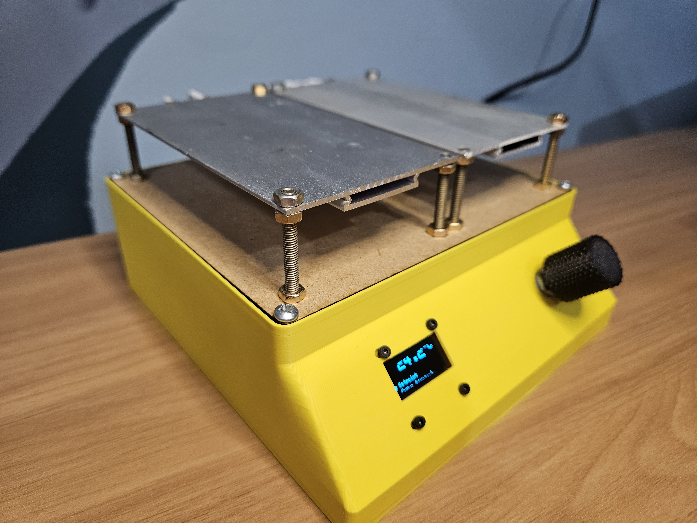
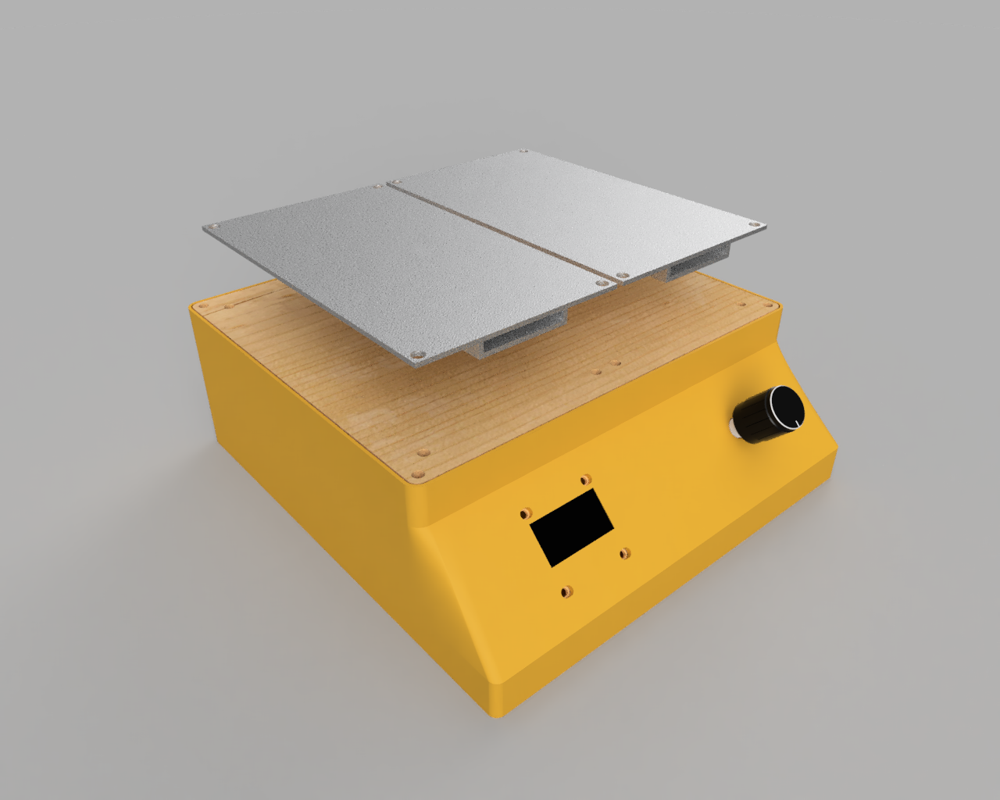
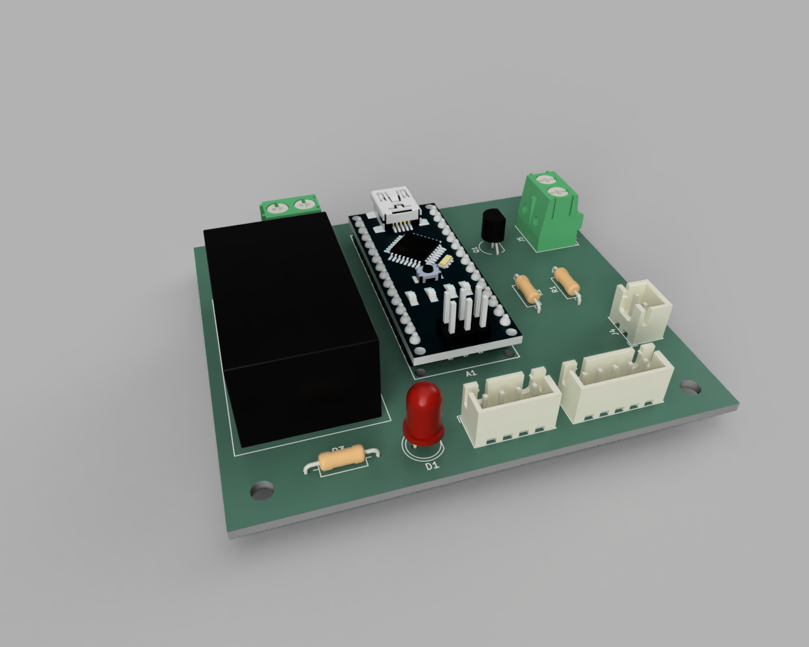
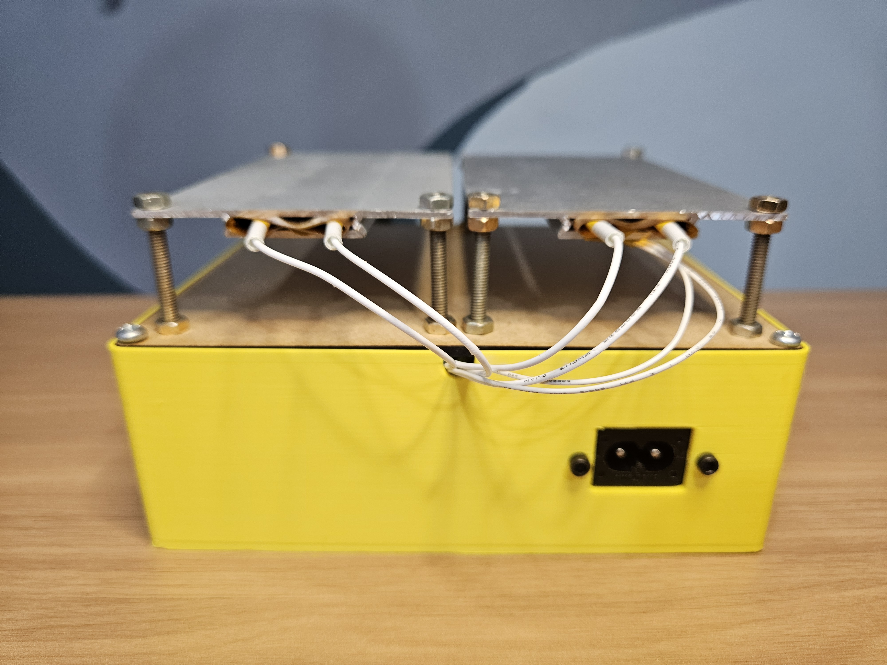
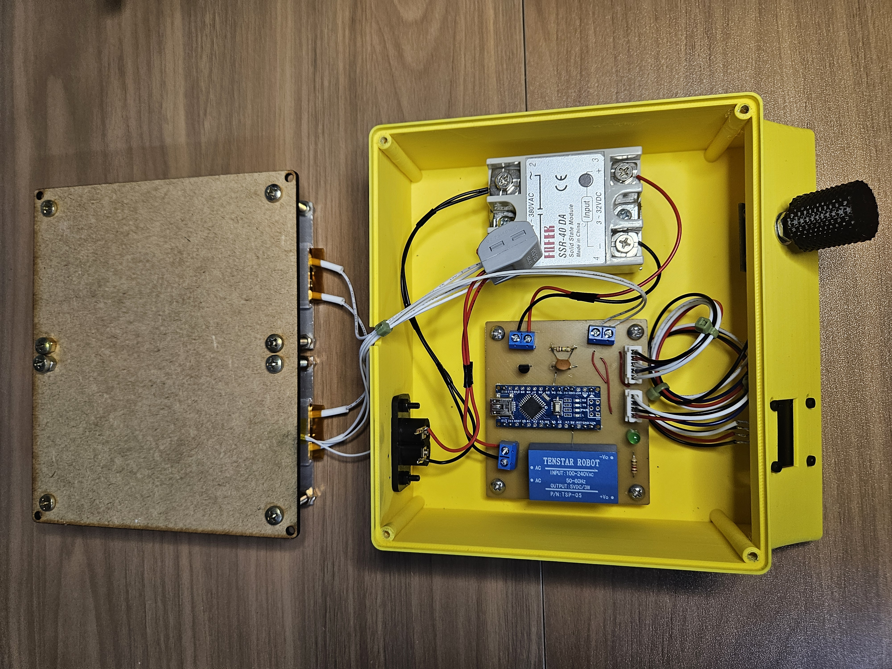

# 🔥 SMD Hotplate Controller

> A temperature controller for SMD soldering hotplates — hardware, firmware, PCB and 3D enclosure designed and built from scratch.

---

---

## ✨ Highlights

- Temperature control with **PID + thermal inertia compensation**
- **Automatic reflow profile**
- PCB designed and hand-fabricated (milling + etching)
- Enclosure **modeled and 3D printed**
- Interface with **rotary encoder + OLED display**
- Power control via **SSR with slow PWM**

---

## 📸 Gallery

| Full assembly | PCB | 3D Case |
|:---:|:---:|:---:|
|  |  |  |

---

# 🛠️ Hardware
 
### Key Components 

- Microcontroller | Arduino Nano
- Temperature sensor | NTC 100K thermistor (3D printer type)
- Solid State Relay | SSR-40DA 
- Display | 0.96" I²C OLED (SSD1306)
- Interface | Rotary encoder with push button
 

> See the full schematic in [`schematic.pdf`](schematic.pdf).

## 🔥 Reflow Profile

The firmware runs an automatic reflow profile with the following stages:

| Stage | Target temperature | Approx. duration |
|---|---|---|
| Preheat | 100 °C | ~60 s |
| Soak | 150 °C | ~90 s |
| Reflow | 220 °C | ~30 s |
| Cooling | Ambient | natural |

---

## 🚀 Usage

### Manual mode
1. Power on the controller
2. Rotate the encoder to set the desired temperature
3. Press the encoder to start / pause heating
4. The display shows current temperature and the setpoint temperature

### Automatic reflow mode
1. In the menu, select **Curva temperatura**
2. Confirm with the encoder
3. Wait for the full cycle — the controller shuts off automatically at the end

---

## ⚠️ Safety warnings

This project involves **mains voltage (110 V AC)** and **surfaces that exceed 250 °C**. Please read before use:

- Never touch the hotplate or SSR during operation without checking the temperature first
- The enclosure **does not electrically isolate** internal components — never open it while connected to mains power
- Use an SSR rated for the current draw of your hotplate (check the specification)
- The hotplate reaches operating temperature quickly — never leave it unattended
- If overheating or unexpected behavior occurs, disconnect from mains immediately

> ⚡ **Use at your own risk.** This is an experimental project with no safety certification.

---

## 📄 License

Distributed under the **MIT License**. See [`LICENSE`](LICENSE) for details.

---

## 🙋 Contributing

Issues and PRs are welcome! If you build this project, open an issue with a photo — I'd love to see how it turns out. 🔥
